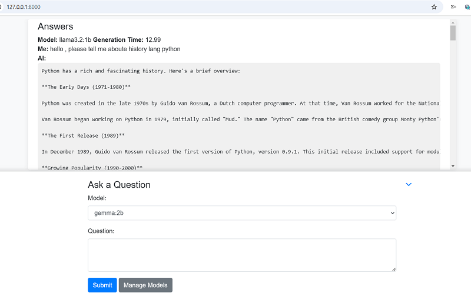

# Django Ollama ChatLab 🚀

A Django-based web interface for interacting with LLMs through local Ollama API

 <!-- Replace with actual screenshot -->

 <!-- Replace with actual screenshot -->

## Key Features ✨
- 💬 Multi-model support (Llama3, Deepseek, Gemma, etc.)
- ⏱️ Response generation time tracking
- 📱 Responsive Bootstrap UI
- 🌊 Real-time streaming responses
- 🔄 Ajax-powered interaction
- ➕ Dynamic model management (add, edit, delete models via UI)
- ⬇️ Minimize/Maximize chat form for better readability
- 📑 Toggleable chat form
- 📋 One-click answer copying
- 🌐 Persian translation integration

## Prerequisites 🔧
- Python 
- Django 
- Ollama (installed and running locally)
- Internet connection for model downloads

## Installation & Setup 🛠️
1. Go to https://ollama.com/search and download Ollama models
```bash
ollama run <model-name>
```
2. Clone repository:
```bash
git clone https://github.com/reza-torabi-Reto/Django-Ollama-ChatLab.git
```
```bash
cd Django-Ollama-ChatLab
python -m venv venv
source venv/bin/activate   # Linux/Mac
venv\Scripts\activate.bat  # Windows
```
3. Install dependencies:
```bash
pip install -r requirements.txt
```
4. Run Ollama server (in new terminal):
```bash
ollama serve
```
5. Apply database migrations:
```bash
python manage.py migrate
```
6. Start development server:
```bash
python manage.py runserver
```
7. Access application at:
```bash
http://localhost:8000
```

## Usage Guide 💻

1.  Go to `http://localhost:8000/`.
2.  Select model from dropdown
3.  Enter question in text field
4.  Send using Enter key or Send button
5.  View response with generation time

💬 Starting a Chat
1.  Click "Manage Models" button
2.  To add model:
-   Enter model name (matching Ollama model name)
-   Click Add Model
3. To remove model: Click × next to model name

🔄 Advanced Features
-   Answer Translation: Click "ترجمه فارسی" on any response
-   Copy Answers: Click copy icon on responses
-   Toggle Chat Form: Click ▼ icon to maximize chat history

## Dependencies

*   **Django:** Python web framework
*   **requests:** For sending HTTP requests to the Ollama API
*   **Bootstrap:** For designing the user interface
*   **Font Awesome**: For icons

⚙️ Advanced Configuration

Manual model list editing:
```bash
// static/data/models_ai.json
["llama3.2:1b", "deepseek-r1:1.5b", "gemma:2b"]
```
📌 Note: Models must be pre-downloaded via Ollama (e.g., ollama pull llama3.2:1b)

## Contributing  🤝

To contribute to the development of this project, you can submit a Pull Request.

## License

This project is licensed under the MIT License.
