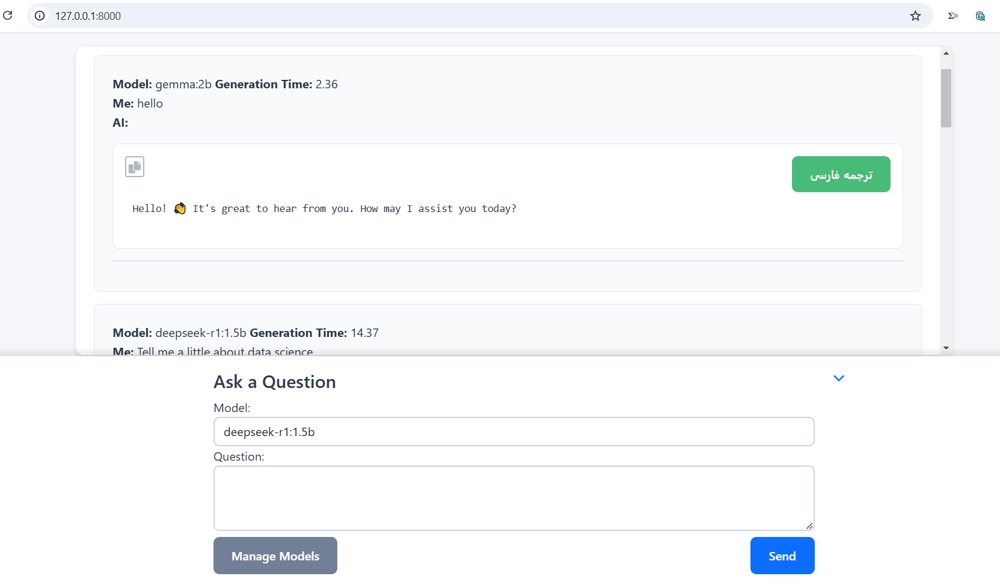

# Django Ollama ChatLab 🚀

A Django-based web interface for interacting with LLMs through local Ollama API

 <!-- Replace with actual screenshot -->

## Key Features ✨
- 💬 Multi-model support (Llama3, Deepseek, Gemma, etc.)
- ⏱️ Response generation time tracking
- 📱 Responsive Bootstrap UI
- 🌊 Real-time streaming responses
- 🔄 Ajax-powered interaction
- ➕ Dynamic model management (add, edit, delete models via UI)
- ⬇️ Minimize/Maximize chat form for better readability


## Prerequisites 🔧
- Python 
- Django 
- Ollama (installed and running locally)
- Internet connection for model downloads

## Installation & Setup 🛠️

1. Clone repository:
```bash
git clone https://github.com/reza-torabi-Reto/Django-Ollama-ChatLab.git
```
```bash
cd Django-Ollama-ChatLab
python -m venv venv
source venv/bin/activate   # Linux/Mac
venv\Scripts\activate.bat  # Windows
```
2. Install dependencies:
```bash
    pip install -r requirements.txt
```
3. Run Ollama server (in new terminal):
```bash
ollama serve
```
4. Apply database migrations:
```bash
python manage.py migrate
```
5. Start development server:
```bash
python manage.py runserver
```
6. Access application at:
```bash
http://localhost:8000
```

Edit static/data/models_ai.json to manage available models:
```bash
["model-x", "model-y", "model-z", ...]
```
📌 Note: Models must be pre-downloaded via Ollama (e.g., ollama pull llama3.2:1b)

## Usage Guide 💻

1.  Go to `http://localhost:8000/`.
2.  Select your desired AI model from the list.
3.  Enter your question in the provided field.
4.  Click the "Submit" button.
5.  The AI-generated answer and the response time will be displayed at the top of the page.
6.  Manage Models:
- Click the "Manage Models" button to open the model management interface.
- Add, edit, or delete models using the provided form.
- Click the "Close" button to return to the chat interface.
7. Minimize/Maximize Chat Form:
- Click the "Down" button (chevron icon) to minimize the chat form and expand the chat history.
- Click the "Up" button (chevron icon) to maximize the chat form and return to the default view.

## Dependencies

*   **Django:** Python web framework
*   **requests:** For sending HTTP requests to the Ollama API
*   **Bootstrap:** For designing the user interface
*   **Font Awesome**: For icons

## Contributing  🤝

To contribute to the development of this project, you can submit a Pull Request.

## License

This project is licensed under the MIT License.
